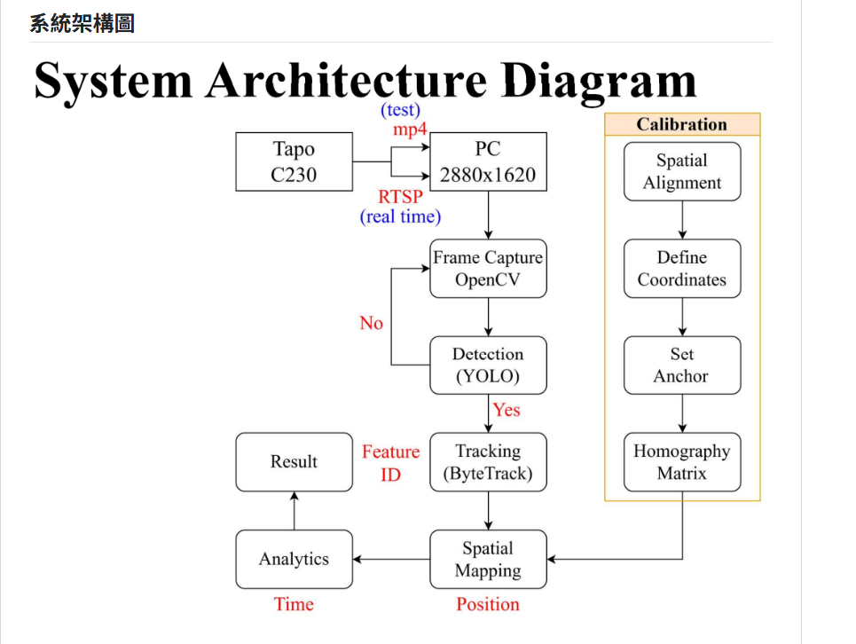
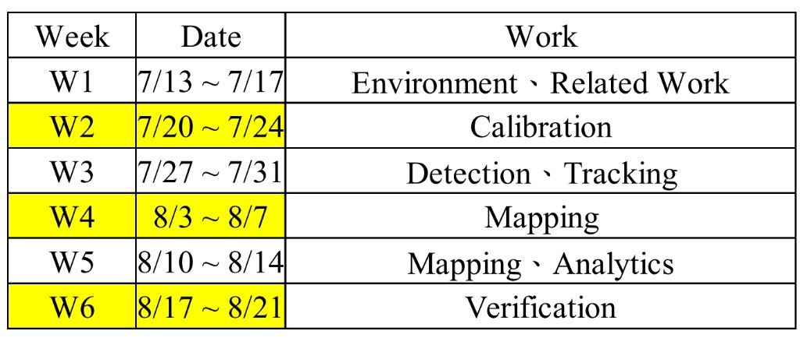
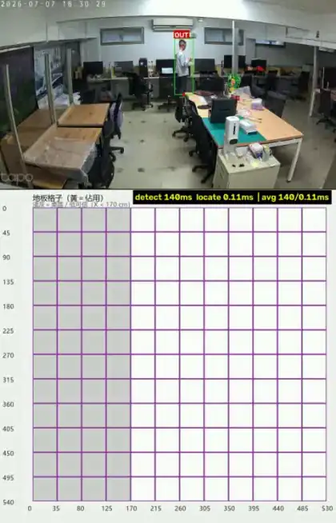

# person-detection-and-tracking

人物偵測與空間定位專案（Tapo C230 / YOLO26 / Homography）。

## 系統架構圖



## 預計進度



## 環境建置

```powershell
cd C:\5Gjump
python -m venv .venv
.\.venv\Scripts\Activate.ps1
pip install -r requirements.txt
```

在 VS Code 選擇解譯器：`Python: Select Interpreter` → `.venv`

首次執行偵測時會自動下載 `yolo26s.pt`（也可改用 `yolo26n.pt` / `yolo26m.pt`）。

## OpenCV RTSP 即時測試

```powershell
python test_rtsp.py "rtsp://帳號:密碼@攝影機IP:554/stream1"
```

- 預覽預設寬度 ≤ 1280（仍讀取完整 2880×1620）
- 按 `q` 結束
- 無視窗：`python test_rtsp.py "rtsp://..." --no-preview --frames 60`
- 腳本會將 RTSP 設為 **TCP** 傳輸（較穩）

```powershell
$env:RTSP_URL = "rtsp://帳號:密碼@攝影機IP:554/stream1"
python test_rtsp.py
```

完整偵測流程的降延遲說明見下方「RTSP 降延遲」。
## Calibration

地板 Homography 有兩個版本（都保留，互不覆蓋）：

| 版本 | 檔案 | 作法 | 備註 |
|------|------|------|------|
| **v1** | `calibration/homography_v1_manual.json` | 手動點選磁磚角（`calibrate_boundary.py`） | 平均重投影誤差約 2.0 cm |
| **v2** | `calibration/homography_v2_chessboard.json` | 地板大棋盤格自動角點（`calibrate_chessboard_floor.py`） | 平均重投影誤差約 0.2 cm；軸向已對齊房間 X/Y |

預設腳本讀 `calibration/homography.json`（目前＝**v2**）。要比對 v1 時加上 `--calib`：

```powershell
python detect_grid.py --source test/test.mp4 --calib calibration/homography_v1_manual.json
python detect_grid.py --source test/test.mp4 --calib calibration/homography_v2_chessboard.json
```

座標系：
- 虛擬左上角為 `(0,0)`（點不到也沒關係）  
- 有效地板區約 `X 170~530 cm`、`Y 0~540 cm`（左側桌區遮擋）  
- 地磚：左側第一格 35 cm，其餘 45 cm  

重跑／驗證：

```powershell
# v1 手動點選
python calibrate_boundary.py --width 530 --height 540
python verify_homography.py

# v2 棋盤格（先 capture 再 calibrate）
python calibrate_chessboard_floor.py capture --source "rtsp://帳號:密碼@攝影機IP:554/stream1"
python calibrate_chessboard_floor.py calibrate --image calibration/chessboard_floor/capture.jpg --origin-x 190 --origin-y 400 --out calibration/homography_v2_chessboard.json
```

## 平面格子佔用

格子刻度見 `test/floor_grid_generated.jpg`（參考手繪：`test/floor_grid.png`）。

```powershell
python grid_occupancy.py
python grid_occupancy.py --x 215 --y 360
```

監視器點選地板 → 對應格子點亮。  
圖例：黃＝佔用；淺灰＝桌區／低可信（`X < 170 cm`）。

## YOLO 人框測試

預設模型：`yolo26s.pt`。

```powershell
python detect_person.py --source test/test.mp4 --no-map
python detect_person.py --source "rtsp://帳號:密碼@攝影機IP:554/stream1" --no-map
```

## 偵測 + 定位（腳點 → 格子）

以 bbox 底邊中點為腳點；桌旁被擋時可用 `--ref auto` / `--ref head_drop`。

**目前建議先用本機影片驗證定位**（較穩）：

```powershell
python detect_grid.py --source test/test.mp4 --ref auto
python detect_grid.py --source test/test.mp4 --ref foot
```

RTSP 即時範例（建議搭配跳幀與防抖）：

```powershell
python detect_grid.py --source "rtsp://帳號:密碼@攝影機IP:554/stream1" --ref auto --stride 3 --cell-hold 2
```

- 畫面：人框 + 腳點；超出範圍才標 `OUT`
- 格子視窗：右上角固定顯示上次 `detect`／`locate` 耗時（沒偵測到人也會保留上一次數值，不會消失／閃爍）
- 按 `q` 結束，`s` 存圖  
- **即時格子定位準度仍待修正**（本機影片較穩）

測試影片：`test/test.mp4`

### RTSP 降延遲（自動啟用）

來源為 `rtsp://` 時，`detect_grid.py` / `detect_person.py` 會自動做兩件事（實作見 `latest_frame.py`）：

1. **只處理最新幀（`LatestFrameCapture`）**  
   YOLO 推論較慢時，OpenCV/FFmpeg 會把攝影機新幀堆在緩衝區；若依序 `cap.read()`，畫面會落後數秒。背景執行緒持續讀流並**只保留最新一幀**（舊幀直接覆蓋丟棄），主執行緒每次推論都拿「當下最新畫面」，優先保證即時性（中間幀會被捨棄）。

2. **RTSP 走 TCP**  
   開串流前設定 `OPENCV_FFMPEG_CAPTURE_OPTIONS=rtsp_transport;tcp`，比 UDP 穩、較少因封包遺失造成卡頓或重連。

這與下方 `--stride` 不同：

| 機制 | 目的 | 作用 |
|------|------|------|
| `LatestFrameCapture` | 降低「畫面落後感」 | 丟緩衝區舊幀，永遠處理最新畫面 |
| `--stride` | 降低運算量 | 不必每幀都跑 YOLO |

本機 `.mp4` 不會啟用最新幀讀取（逐幀播放比較合理）。

### 跳幀（`--stride`）

RTSP／影片不必每幀都跑 YOLO，可跳幀降低運算量，中間幀沿用上次偵測結果：

```powershell
python detect_grid.py --source test/test.mp4 --stride 3
```

- `--stride N`：每 N 幀才跑一次 YOLO（預設 1＝每幀都跑）
- 格子視窗會標示 `cached`，代表這幀是沿用結果、不是新偵測

### 格子防抖（`--cell-hold`）

站著不動時，因 bbox 微小晃動（例如身體扭動）經 Homography 放大，偶爾會讓判定的格子跳到隔壁格造成閃爍。加上防抖：

```powershell
python detect_grid.py --source test/test.mp4 --cell-hold 2
```

- 格子需連續 N 次偵測結果一致才會點亮／熄滅（預設 2；設 1 等於關閉防抖）
- 這裡的「N 次」以**偵測次數**計算（跟 `--stride` 搭配時，只算真正跑 YOLO 的那幀，不受跳幀影響其穩定邏輯）
- `export_demo_video.py` 也支援同名的 `--stride` / `--cell-hold`

## Demo 影片（左：偵測，右：格子）

由 `test/test.mp4` 匯出的合成結果（左監視器畫面、右平面格子）：

<p align="center">
  
</p>

## 狀態備註（2026-07-22）

- 已完成：YOLO26 偵測、影片腳點／格子定位、格子 UI、RTSP 取流與降延遲（`LatestFrameCapture` 最新幀 + TCP）、跳幀（`--stride`）、格子防抖（`--cell-hold`）  
- 未完成／暫緩：多人 ID 追蹤、外貌 Re-ID、即時 RTSP 定位準度調校  

## 文件

- [今日報告 7/10](PPT%20report/報告7_10.pdf)
