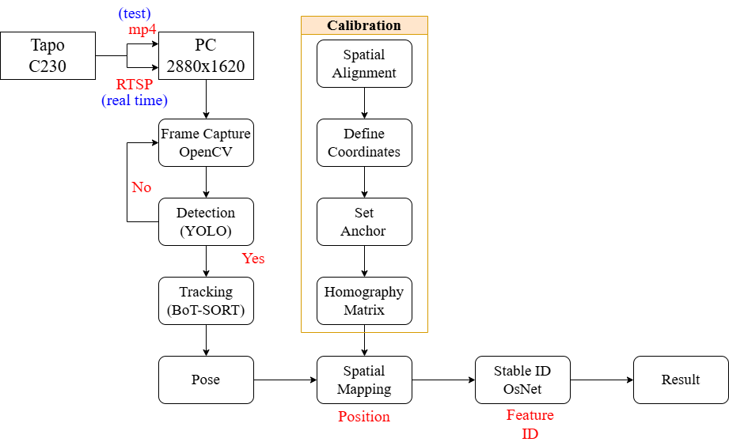
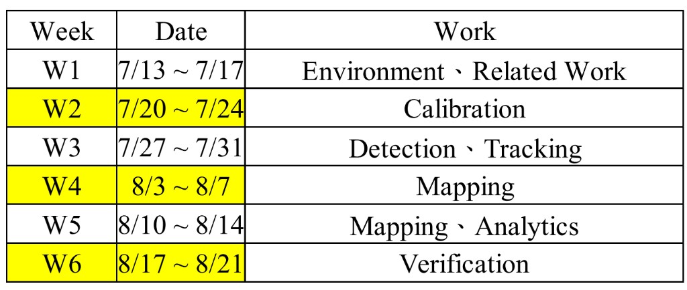
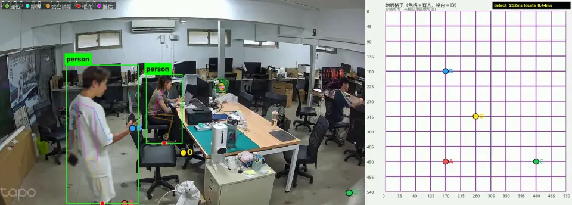

# person-detection-and-tracking

人物偵測與空間定位專案（Tapo C230 / YOLO26 / Homography）。

## 系統架構圖

<p align="center">
  
</p>

## 預計進度

<p align="center">
  
</p>

## 環境建置

```powershell
cd C:\5Gjump
python -m venv .venv
.\.venv\Scripts\Activate.ps1
pip install -r requirements.txt
```

在 VS Code 選擇解譯器：`Python: Select Interpreter` → `.venv`

首次執行偵測時會自動下載 `yolo26s.pt`（也可改用 `yolo26n.pt` / `yolo26m.pt`）。

## OpenCV RTSP 即時測試

```powershell
python test_rtsp.py "rtsp://帳號:密碼@攝影機IP:554/stream1"
```

- 預覽預設寬度 ≤ 1280（仍讀取完整 2880×1620）
- 按 `q` 結束
- 無視窗：`python test_rtsp.py "rtsp://..." --no-preview --frames 60`
- 腳本會將 RTSP 設為 **TCP** 傳輸（較穩）

```powershell
$env:RTSP_URL = "rtsp://帳號:密碼@攝影機IP:554/stream1"
python test_rtsp.py
```

完整偵測流程的降延遲說明見下方「RTSP 降延遲」。
## Calibration

地板 Homography 有兩個版本（都保留，互不覆蓋）：

| 版本 | 檔案 | 作法 | 備註 |
|------|------|------|------|
| **v1** | `calibration/homography_v1_manual.json` | 手動點選磁磚角（`calibrate_boundary.py`） | 點擊量測誤差約 **8.9 cm** |
| **v2** | `calibration/homography_v2_chessboard.json` | 地板大棋盤格自動角點（`calibrate_chessboard_floor.py`） | 目前預設；點擊量測誤差約 **3.8 cm** |

預設腳本讀 `calibration/homography.json`（目前＝**v2**）。要比對 v1 時加上 `--calib`：

```powershell
python detect_grid.py --source test/test.mp4 --calib calibration/homography_v1_manual.json
python detect_grid.py --source test/test.mp4 --calib calibration/homography_v2_chessboard.json
```

座標系：
- 虛擬左上角為 `(0,0)`（點不到也沒關係）  
- 地板格範圍約 `X 0~530 cm`、`Y 0~540 cm`  
- 地磚：左側第一格 35 cm，其餘 45 cm  
- 預設**不再**把左側畫成淺灰桌區（`--valid-xmin 0`）；若要恢復舊遮罩：`--valid-xmin 170` 

重跑／驗證：

```powershell
# v1 手動點選
python calibrate_boundary.py --width 530 --height 540
python verify_homography.py

# v2 棋盤格（先 capture 再 calibrate）
python calibrate_chessboard_floor.py capture --source "rtsp://帳號:密碼@攝影機IP:554/stream1"
python calibrate_chessboard_floor.py calibrate --image calibration/chessboard_floor/capture.jpg --origin-x 190 --origin-y 400 --out calibration/homography_v2_chessboard.json
```

真實定位誤差（點擊已知地板點 + 輸入卷尺座標，不是棋盤擬合殘差）：

```powershell
python verify_homography.py --measure-error
python verify_homography.py --measure-error --calib calibration/homography_v1_manual.json
python verify_homography.py --measure-error --image calibration/chessboard_floor/capture.jpg
```

結束後會印平均／最大誤差，並可存 `calibration/homography_error_report.json`。

## 平面格子佔用

格子刻度見 `test/floor_grid_generated.jpg`（參考手繪：`test/floor_grid.png`）。

```powershell
python grid_occupancy.py
python grid_occupancy.py --x 215 --y 360
```

監視器點選地板 → 對應格子點亮。  
圖例：黃＝佔用；若加 `--valid-xmin 170`，淺灰＝桌區／低可信（`X < 170 cm`）。

## YOLO 人框測試

預設模型：`yolo26s.pt`。

```powershell
python detect_person.py --source test/test.mp4 --no-map
python detect_person.py --source "rtsp://帳號:密碼@攝影機IP:554/stream1" --no-map
```

## 偵測 + 定位（腳點 → 格子）

以 bbox 底邊中點為腳點；桌旁被擋時可用 `--ref auto` / `--ref head_drop`。  
測試影片：`test/test.mp4`。按 `q` 結束，`s` 存圖。

**定位對照（此分支 `feature/floor-grid-overlay`，報告用，尚未合入 main）**

相機與右側格子畫同一組 **四個地上點**（無線、人框只標 ID）。不含遠右角，避免投到桌子／家具上。

| 點 | 世界座標 (cm) | 位置 |
|---|---|---|
| **A** | (170, 450) | 近左 |
| **B** | (170, 180) | 遠左 |
| **C** | (440, 450) | 近右 |
| **O** | (260, 315) | 走道中心 |

座標存在 `calibration/floor_marks.json`。此分支預設開啟；`--no-floor-grid` 可關。

若要改點，只點看得見的地面：

```powershell
python pick_floor_marks.py --source test/static_frame.jpg
# 或影片某一幀：
python pick_floor_marks.py --source test/test4.mp4 --frame 1
```

依序點 A（近左）→ B（遠左）→ C（近右）→ O（正中心），按 `s` 覆寫 `floor_marks.json`。

### 人物 ID（Stable-ID）

管線：`YOLO26.track(persist=True)` → **BoT-SORT**（短期）→ **Stable-ID + OSNet-AIN**（長期 ID）。畫面只標 `ID1`…；人框與格子同一套顏色。不假設場上只有一人。

**短追蹤**（`trackers/botsort.yaml`）
- 固定監視器：`gmc_method: none`
- 不開 BoT-SORT ReID（`with_reid: False`）；外貌交給 Stable-ID
- `new_track_thresh: 0.65`：門邊碎框不開新軌
- 不要把 OSNet `.pth` 寫進 yaml

**Stable-ID**
- 即時圖庫 `test/reid_gallery/`：每次重跑清空；比對用記憶體向量，不讀回 jpg
- 審查庫 `test/reid_review/`：**預設關閉**。加 `--review-dump` 才存裁圖（不參與即時比對；背景 Pillow 寫檔，避免拖慢 YOLO）
- 圖庫只接受乾淨、低重疊的人框，避免相鄰人物污染 `first.jpg` 與外貌原型
- 每幀以衣著色彩修正明顯換人；陌生 raw track 先短暫隔離，確認後建立新 ID
- 同一人雙框（IoU／包覆）合併，留較舊號
- 室內漏檢沿用約 1.2 秒；框貼畫面邊緣立刻清除（人已離開）
- 新 ID 須連續對不上圖庫（`--min-hits` 預設 16）才發號；開頭約 **3.8–4 秒** 才會出現第一個框（`--stride 5`、約 20 fps 時：16 次偵測 × 5 幀 ÷ 20 ≈ 4 秒。`test4.mp4` 實測約第 76 幀／3.8 秒）

**問題與作法**

| 遇到的問題 | 作法 |
|------|------|
| 同一支本機影片、不同時間跑，ID 結果不同 | 以前為了跟時間軸會丟幀，電腦忙時丟得多。現在固定只處理第 `1, 1+stride, …` 幀；`--realtime` 只限播放速度，不丟追蹤幀 |
| 預覽卡、CPU 忙時追蹤更不穩 | 追蹤幀全留；本機預覽約每 3 幀才畫一次，不改 BoT-SORT 輸入。OSNet 全身稽核改約每秒一次 |
| `first.jpg` 混進隔壁人，之後一直配錯 | 圖庫只收乾淨、低重疊框；衣著顏色明顯不同的兩框不再合併成同一人 |
| 藍衣／綠衣被短追蹤接錯，一秒後才改回來 | 每幀用上半身 HSV 對初次登錄顏色；明顯不像自己、又很像另一個空缺 ID 就當場改回 |
| 新人出現在舊人前面，直接繼承舊 ID | 不像任何已知 ID 的 raw track 先隔離數幀，確認後發新號並寫圖庫，回來可配回同一號 |
| 剛發新 ID 就崩潰（`KeyError`） | 交換檢查只比對已登錄完成的身份 |
| 開 `--review-dump` 時追蹤變慢或不穩 | 審查圖改背景 Pillow 寫檔，不參與即時 Re-ID |
| 影片開頭好幾秒都沒框人 | 不是漏檢，是在等新 ID 確認。預設 `--min-hits 16`、`--stride 5`、約 20 fps → 約 4 秒才發第一個號。已登錄的人再出現不必再等這段；若要更快可把 `--min-hits` 降小，但門邊碎框較容易開新號 |

```powershell
# 建議
python detect_grid.py --source test/test.mp4 --ref auto --cell-hold 2 --quiet --reid-model osnet_ain

# 要存錯圖審查時再加
python detect_grid.py --source test/test4.mp4 --ref auto --cell-hold 2 --quiet --reid-model osnet_ain --review-dump

# RTSP
$env:OPENCV_FFMPEG_CAPTURE_OPTIONS = "rtsp_transport;tcp"
python detect_grid.py --source "rtsp://帳號:密碼@IP:554/stream1" --ref auto --cell-hold 2 --quiet --reid-model osnet_ain

# 只要人框、不要 ID
python detect_person.py --source test/test.mp4 --no-map
python detect_grid.py --source test/test.mp4 --no-track
```

### RTSP 降延遲（自動啟用）

來源為 `rtsp://` 時，`detect_grid.py` / `detect_person.py` 會自動做兩件事（實作見 `latest_frame.py`）：

1. **只處理最新幀（`LatestFrameCapture`）**  
   YOLO 推論較慢時，OpenCV/FFmpeg 會把攝影機新幀堆在緩衝區；若依序 `cap.read()`，畫面會落後數秒。背景執行緒持續讀流並**只保留最新一幀**（舊幀直接覆蓋丟棄），主執行緒每次推論都拿「當下最新畫面」，優先保證即時性（中間幀會被捨棄）。

2. **RTSP 走 TCP**  
   開串流前設定 `OPENCV_FFMPEG_CAPTURE_OPTIONS=rtsp_transport;tcp`，比 UDP 穩、較少因封包遺失造成卡頓或重連。

這與下方 `--stride` 不同：

| 機制 | 目的 | 作用 |
|------|------|------|
| `LatestFrameCapture` | 降低「畫面落後感」 | 丟緩衝區舊幀，永遠處理最新畫面 |
| `--stride` | 降低運算量 | 不必每幀都跑 YOLO |

本機 `.mp4` 不會啟用最新幀讀取；固定處理第 `1, 1+stride, 1+2×stride, ...` 幀，避免電腦負載不同造成 BoT-SORT 輸入與 ID 結果改變。

### 跳幀（`--stride`）

RTSP／影片不必每幀都跑 YOLO，可跳幀降低運算量，中間幀沿用上次偵測結果：

```powershell
python detect_grid.py --source test/test.mp4 --stride 3
```

- `--stride N`：每 N 幀才跑一次 YOLO（**預設 5** ≈ 20fps 時每秒 4 次；設 1＝每幀都跑）
- 格子視窗會標示 `cached`，代表這幀是沿用結果、不是新偵測
- 本機影片的 `--realtime`（預設開）只限制播放速度不超過來源 FPS；推論慢時會變慢，但不丟追蹤幀。`--no-realtime` 可取消等待，追蹤取樣幀不變

### 格子防抖（`--cell-hold`）

站著不動時，因 bbox 微小晃動（例如身體扭動）經 Homography 放大，偶爾會讓判定的格子跳到隔壁格造成閃爍。加上防抖：

```powershell
python detect_grid.py --source test/test.mp4 --cell-hold 2
```

- 格子需連續 N 次偵測結果一致才會點亮／熄滅（預設 2；設 1 等於關閉防抖）
- 這裡的「N 次」以**偵測次數**計算（跟 `--stride` 搭配時，只算真正跑 YOLO 的那幀，不受跳幀影響其穩定邏輯）
- `export_demo_video.py` 也支援同名的 `--stride` / `--cell-hold`

## 目前建議設定（2026-08-14）

| 項目 | 設定 |
|------|------|
| Homography | **v2**（`calibration/homography.json`） |
| 定位對照（此分支） | 地上四點 A/B/C/O，見 `calibration/floor_marks.json`；`--no-floor-grid` 可關 |
| 偵測 | `yolo26s.pt`、`--ref auto`、`--conf 0.45`、`--cell-hold 2` |
| 短追蹤 | BoT-SORT（`trackers/botsort.yaml`；GMC off、短 ReID off） |
| 長期 ID | Stable-ID + `--reid-model osnet_ain`；`--min-hits 16`；`--appear-thresh 0.34` |
| 效能 | `--stride 5`（約每秒 4 次）；本機影片同步、固定取樣以確保可重現；RTSP 維持背景執行緒與最新幀模式 |
| 審查庫 | 預設關；`--review-dump` 寫入 `test/reid_review/<時間>/ID***/` |

```powershell
python detect_grid.py --source test/test.mp4 --ref auto --cell-hold 2 --quiet --reid-model osnet_ain
```

舊校正：`--calib calibration/homography_v1_manual.json`；舊桌區灰格：`--valid-xmin 170`。舊短追蹤：`--tracker trackers/bytetrack_stable.yaml`。

## Demo 影片（左：偵測，右：格子）

**目前主 demo（Stable-ID + OSNet-AIN）**，使用 `test/test4.mp4` 與實際 `detect_grid.py` 流程錄製。

一般測試與審查指令：

```powershell
python detect_grid.py --source test/test4.mp4 --ref auto --cell-hold 2 --quiet --reid-model osnet_ain --review-dump
```

錄製同一套追蹤結果（不開預覽視窗）：

```powershell
python detect_grid.py --source test/test4.mp4 --ref auto --cell-hold 2 --quiet --reid-model osnet_ain --review-dump --save-video test/demo_stable_id_osnet_ain.mp4 --no-show --no-realtime
```

| 版本 | 影片 | WebP |
|------|------|------|
| **Stable-ID + OSNet-AIN / test4**（目前） | `test/demo_stable_id_osnet_ain.mp4` | `test/demo_stable_id_osnet_ain.webp` |
| Homography **v2**（舊，僅定位） | `test/demo_v2_chessboard.mp4` | `test/demo_v2_chessboard.webp` |
| Homography **v1** | `test/demo_v1_manual.mp4` | `test/demo_v1_manual.webp` |

<p align="center">
  
</p>

## 狀態（2026-08-17）

**已完成**
- YOLO26 官方 `model.track` + BoT-SORT 短追蹤；長期 ID 仍由 Stable-ID + OSNet-AIN  
- 重疊雙框合併、門邊碎框較難開新號、室內漏檢短沿用／貼邊立刻清  
- 即時圖庫與審查庫分開：審查圖不進 Re-ID；審查預設關，避免寫檔拖慢追蹤  
- 本機影片固定追蹤幀，重跑結果不再受即時丟幀與電腦負載改變  
- 陌生人物不再直接冒用既有 ID；短暫確認後建立可供回場比對的新 ID  
- RTSP 保留背景 YOLO、最新幀與 TCP 降延遲；格子支援防抖與跳幀  
- 報告用地板對照：相機／格子同一組 A/B/C/O（此分支 `feature/floor-grid-overlay`，尚未合入 main）  

**尚未解決**
- 多人遮擋／漏檢仍可能閃號（坐著、趴著、被擋時 `conf=0.45` 較易漏）  
- 近鏡頭大框易吃到另一人 → 圖庫可能拒寫或外貌混淆  
- `test3.mp4` 的人數多、停留短且交叉頻繁；目前 `--min-hits 16` 與陌生人隔離較保守，可能延遲或隱藏新 ID，尚待加入依框品質調整的自適應發號  
- 換裝、跨鏡頭、畸變校正接入管線  
- 遠右地板角被桌子擋住，對照點暫不標該角；此分支尚未合入 `main`  

## 文件

- [8/7](PPT%20report/報告8_7.pdf)
- [7/24](PPT%20report/報告7_24.pdf)
- [7/10](PPT%20report/報告7_10.pdf)
